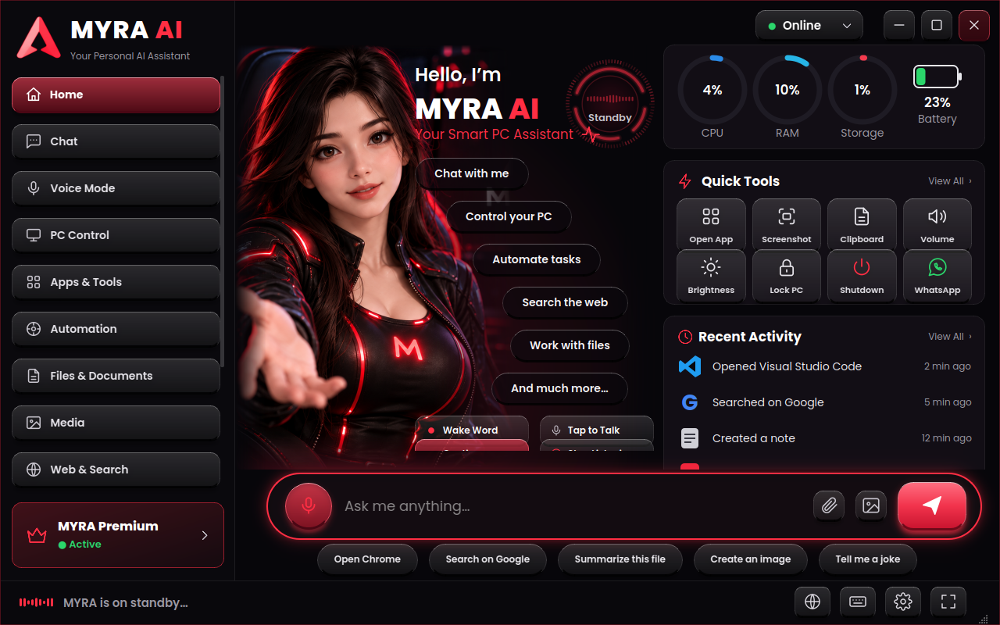

# MYRA — Install & Setup Guide

**MYRA** is a voice-first AI assistant powered by Google Gemini. It talks to you in **148+ languages** (Hindi, Hinglish, English, Tamil, Spanish, Japanese…), sees your screen/camera, and controls your device with real tools.

This repository contains **only the install / update / uninstall commands and setup guides**. The source code is **not** published here — MYRA is installed from PyPI.



## Pick your platform

| Platform | Package | What you get | Guide |
|---|---|---|---|
| **Windows 10/11** | [`myra-ai-assistant`](https://pypi.org/project/myra-ai-assistant/) | Full desktop app: UI, Gemini Live voice, orb, screen guardian, 40+ tools | [docs/windows.md](docs/windows.md) |
| **Linux** (Ubuntu/Debian, WSL) | [`myra-linux`](https://pypi.org/project/myra-linux/) | Same desktop UI + Gemini Live voice + Linux system tools | [docs/linux.md](docs/linux.md) |
| **Android (Termux)** | [`myra-termux`](https://pypi.org/project/myra-termux/) | Phone UI in your browser, Gemini Live voice that keeps listening, phone automation | [docs/termux.md](docs/termux.md) |
| **Linux server / SSH** | [`myra-termux`](https://pypi.org/project/myra-termux/) | Text chat in the terminal | [docs/termux.md](docs/termux.md#text-only-linux-servers) |

## One-line installs

**Windows** (PowerShell or CMD, Python 3.11 64-bit):
```
pip install --upgrade myra-ai-assistant && myra install && myra
```

**Linux** (Ubuntu / Debian / WSL):
```
sudo apt install -y pipx libportaudio2 libxcb-cursor0 libxkbcommon-x11-0 libxcb-icccm4 libxcb-image0 libxcb-keysyms1 libxcb-render-util0 libxcb-xinerama0 libgl1 libpulse0 libasound2-plugins pulseaudio-utils tesseract-ocr scrot python3-tk xclip libnotify-bin playerctl brightnessctl wmctrl xdotool network-manager && pipx ensurepath && export PATH="$HOME/.local/bin:$PATH" && pipx install myra-linux && myra-linux install && myra-linux
```

**Android — Termux:**
```
pkg update && pkg install -y python termux-api && pip install --upgrade myra-termux && myra-termux alias && source ~/.bashrc && myra
```

You need a free **Gemini API key**: <https://aistudio.google.com/apikey>. MYRA asks for it the first time you run it and stores it only on your own device.

## Update / uninstall cheat-sheet

| | Windows | Linux | Termux |
|---|---|---|---|
| **Run** | `myra` | `myra-linux` | `myra` (or `myra-termux`) |
| **Update** | `pip install --upgrade myra-ai-assistant` | `myra-linux update` *(or `pipx upgrade myra-linux`)* | `pip install --upgrade myra-termux` |
| **Start at login** | `myra install` | `myra-linux install` | — |
| **Stop start at login** | `myra uninstall` | `myra-linux uninstall` | — |
| **Status** | `myra status` | `myra-linux status` | — |
| **Remove** | `myra uninstall` then `pip uninstall myra-ai-assistant` | `myra-linux remove` *(add `--purge` to delete settings too)* | `pip uninstall myra-termux` |

## What MYRA can do

| Feature | Windows | Linux | Termux (Android) |
|---|:--:|:--:|:--:|
| Gemini Live voice conversation | ✅ | ✅ | ✅ (always-listening) |
| 148+ languages, say *"speak Spanish"* | ✅ | ✅ | ✅ |
| Remembers your name | ✅ | ✅ | ✅ |
| Desktop UI / floating orb | ✅ | ✅ | phone UI |
| Open any installed app by name | ✅ | ✅ | ✅ |
| Volume, brightness, lock, clipboard | ✅ | ✅ | ✅ |
| Camera vision, screen share, screen guardian | ✅ | ✅ ¹ | — |
| Spotify | plays | opens search | opens search |
| WhatsApp | automation | opens chat | opens chat (you press Send) |
| SMS / calls / contacts / alarm / timer | — | — | ✅ (asks permission first) |
| Notes, PDFs, QR codes, system status, OCR | ✅ | ✅ | — |

¹ Camera/screen share are included on Linux but have been tested less than on Windows.

Honest limits: Android does not let any app tap inside other apps without root/ADB, and Linux does not let apps auto-play Spotify tracks — MYRA tells you this instead of pretending it worked.

## Troubleshooting (most common)

| Problem | Fix |
|---|---|
| `No command myra found` (Termux) | Run `source ~/.bashrc`, or restart Termux, or use `myra-termux` |
| `pip install` says *externally-managed-environment* (Ubuntu 24.04) | Use `pipx install myra-linux` (see [docs/linux.md](docs/linux.md)) — never `--break-system-packages` |
| New version not found right after a release | Wait 1–2 minutes, then `pip install --upgrade --no-cache-dir <package>` (pipx: `--pip-args="--no-cache-dir"`) |
| No microphone / speaker on Linux or WSL | `sudo apt install libasound2-plugins pulseaudio-utils`, then `myra-linux status` should show `Audio: OK` |
| Voice does nothing on phone | Allow the microphone for Chrome (lock icon in the address bar), keep the Termux window open |
| Android refuses to open an app/alarm | Tap the big **button** MYRA shows, or enable *Settings → Apps → Termux → Display over other apps* |
| API key rejected | Create a new key at aistudio.google.com/apikey and paste it again (MYRA validates it) |

More in [docs/troubleshooting.md](docs/troubleshooting.md).

## Privacy & security

- Your API key and settings stay on **your device** (`~/.aria` on Windows/Linux, `~/.myra_termux` on Termux).
- The Termux phone UI listens on `127.0.0.1` only and every request needs a random per-run token.
- SMS, calls and WhatsApp always ask for your explicit permission first.
- Never share your API key or PyPI/GitHub tokens in chats or issues.

## Links


- Support: <https://t.me/codeninjavik1>

*Made by Vikash Kumar — [@codeninjavik](https://github.com/codeninjavik).*
